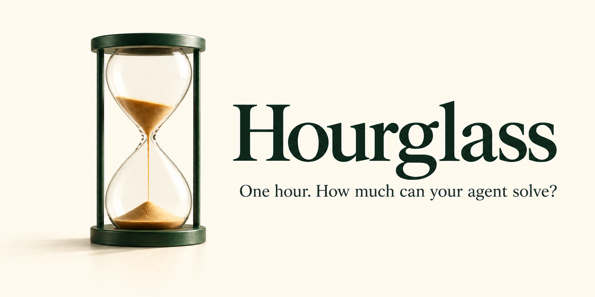

# Hourglass



A local benchmark for tool-using AI models: give each model a private question bank and measure what it solves within **one hour of active wall time**. Thinking, tools, retries, initialization and grading all use that hour.

**Use your coding agent to set up Hourglass. Bring your own questions.** The public repository contains the runtime, a frozen agent harness and a tiny setup demo. Build a bank that tests the work you actually care about, then hold it fixed when comparing models.

## Set up with your agent

Paste this into your coding agent:

```text
Set up https://github.com/JordiPosthumus/hourglass locally. Read README.md,
docs/agent-setup.md and docs/maintenance.md first, then follow the setup
recipe. Inspect my existing model endpoint and preserve its configuration,
limits, reasoning settings, caches and launchers. Do not overwrite an existing
models.json. Use the hello-world demo to validate the connection and frozen
Pi harness. Keep questions, keys, configurations and traces private. Report
what you changed, what you tested and how I start my first timed UI run.
```

The [agent setup recipe](docs/agent-setup.md) includes prerequisites, configuration discovery, verification and the handoff checklist. The supported environment is **macOS on Apple Silicon, Python 3.10+, Git and Node.js 22.19+**. A model endpoint must provide OpenAI-compatible chat completions and tool calling. Vision questions also need a vision-capable model.

For a new checkout:

```sh
git clone https://github.com/JordiPosthumus/hourglass.git
cd hourglass
```

Configure a local `models.json` using `models.example.json` as a format reference. Use the actual endpoint, loaded model ID and verified limits; the example numbers are placeholders. Install the optional connection demo with `python3 scripts/install_demo.py`, then launch `./start-hourglass.sh` in your Terminal. The UI normally opens at `http://127.0.0.1:4534`.

## Issue for Agents

Before setting up or rebuilding a model server, read [known agent/server issues](docs/issues-for-agents.md). Large output requests must use the space remaining after the complete prompt, including tool history and vision inputs. The [replayable patch bundle](backend-patches/output-space/README.md) provides exact source checks, backups, rollback and validation steps. Preserve the owner's established model capabilities and settings.

## Your workspace

**Runs · Archived runs · Questions.** Keep the run view focused, and open the question library when you want to inspect the bank. Click column headings to sort by average answer time, wrong-answer rate, timeouts, execution errors, points or attempt count. Previews show the question and its public files. Sample counts are explicit; unknown statistics stay unknown.

Every benchmark runs the **full installed bank** in its rule-defined order. There are no question-selection controls, and table sorting never changes execution. The server rejects subset requests.

Charts use visible tabs, with points over time first. Run labels identify each series without redundant hardware or rule text. Archive hides an idle run without deleting its evidence; restore it from Archived runs. See the [workspace guide](docs/workspace.md) and [changelog](CHANGELOG.md).

## Build a bank that matters to you

Try repository handoffs, debugging from logs, reconciling conflicting specifications, interpreting charts you generated, checking calculations, or tracing a decision through a small document set. Use synthetic material or material you own and are entitled to send to your model endpoint.

Follow the **[exact question-authoring recipe](docs/question-authoring-recipe.md)**. It includes a copy-paste agent instruction, independent answer checks, distractor design, a blind solve, privacy review and a frozen release checklist. Start with a small, carefully checked pilot. More questions help only when their answers are reliable.

Store your bank under `tasks/`, with one `task.json` per question directory. See the [task format](docs/task-format.md), [JSON Schema](schemas/task.schema.json) and [private Git and backup workflow](docs/private-question-bank.md). The optional [hello-world demo](examples/hello-world) verifies installation; it is not a useful benchmark.

**Scores from different private banks are not directly comparable.** The public tests contain small software fixtures, not a hidden benchmark bank. Private questions, answer keys, images, source bundles and traces are not distributed here.

## How the evaluation works

Hourglass 4.1.0 uses the pinned Pi SDK’s native model declarations, thinking selection, context sizing, compaction and retry defaults. Read [inference profiles](docs/inference-profiles.md) before creating or migrating a configuration. Existing historical profiles keep their saved behavior.

The official **Hourglass Score** is total points earned within one active hour. Correct attempts earn their frozen authored reward; wrong final answers lose one point. During active runs, the UI can show an [experimental predicted final score](docs/score-prediction.md), with earned points underneath. Final results and charts remain measured totals. See [the score definition](docs/scoring.md).

1. The UI freezes the full installed question bank, rule-defined order, model configuration and evaluation policies.
2. The bundled Pi agent works through the questions using files, bash and tools in isolated workspaces.
3. Hourglass grades submissions and records timing, usage, evidence and configuration provenance.
4. The controller stops the benchmark process group at 3,600 active seconds. Pauses between resumes do not count.

New runs use `net-hour-v3`. Total points are the sum of each attempt’s correct-answer reward or wrong-answer penalty within one hour. A correct answer earns its frozen authored weight; an incorrect final answer loses one point. Unfinished and unsupported outcomes earn zero. Official scoring has no AUC, forecast or custom calibration; the experimental live forecast is a separate display-only estimate.

Questions rotate through difficulty bands and subjects; challenge and repository-discovery groups, when present in the bank, have a documented cadence. Each attempt has a 15-minute limit within the original one-hour clock. After the first pass, repeat the entire bank using the latest attempt: wrong answers first, then unfinished questions, then correct answers; slowest first in every group. Each attempt has a fresh conversation and workspace, without previous answers or grading. An unscored warm-up precedes each new run and resume, before the scoring clocks start. New runs randomize option IDs and positions using a private run seed; resumes retain that seed. Thus separate runs can have different option layouts even with identical bank files. See [methodology](docs/methodology.md), [prompt contract](docs/prompt-contract.md) and [run identity](docs/run-identity.md) for comparison limits. Authored tiers carry no empirical difficulty claim.

**Start timed evaluations in the UI.** The `hourglass.py run` command is for individual-task diagnostics and does not enforce a whole-evaluation hour by itself. `./stop-hourglass.sh` saves and stops this checkout's work; model servers remain running. Resume uses the saved run and clock when reliable timing evidence exists.

## Built on Pi

Hourglass uses **[Pi](https://github.com/earendil-works/pi)**, created by **Mario Zechner and the Pi contributors**. Pi supplies the agent loop, file tools, bash and compaction. Hourglass supplies question preparation, workspace restrictions, grading, the timed controller, results and the UI.

This repository vendors **Pi 0.85.1** and its dependencies, verifies the snapshot against a per-file SHA-256 manifest before every attempt, and does not depend on a global Pi installation. The snapshot includes Darwin ARM64 dependencies; other platforms are not currently validated. Read [the frozen Pi design and credit](docs/frozen-pi.md), [third-party notices](THIRD_PARTY_NOTICES.md) and [Pi's MIT license](licenses/pi-MIT.txt).

## Inspect your runs

The current-question view shows the frozen question and the numbered options presented to the model. The live panel separates tool activity from measured generation speed and observed request overlap. Telemetry support and measurement limits are documented in [server telemetry](docs/telemetry.md).

Use Run editor to record model revisions, quantization, server recipes, hardware and other experiment details. Labels do not reconfigure the endpoint. Results retain their original records. See [maintenance](docs/maintenance.md), [manual repairs](docs/manual-repairs.md) and [results history](docs/results-history.md).

The **[published results index](reports/README.md)** records experiments on a private reference bank. These are not universal model rankings. Compare exact question bundles, order, repeats, harness, scoring policy and relevant execution settings; inspect recorded hardware and option-layout differences as well.

## Privacy

The UI binds to loopback and can display your local questions and results. Keep it local. Requests go to your configured endpoint, so a remote endpoint receives the question content. Keep `models.json`, API keys, question banks, answer keys, raw results, logs, traces and backups out of public Git.

Ignored files are a convenience, not an access-control boundary. Inspect every staged file and run `python3 scripts/check_public_release.py` before publishing a fork. Published score reports use the dedicated reviewed export flow; do not publish screenshots of private questions or raw run directories.

## Development and license

```sh
python3 -m unittest discover -s tests -p 'test_*.py'
node tests/test_ui.js
node tests/test_start_run.js
node tests/test_tps.js
node tests/test_speed.js
node tests/test_question_library.js
python3 scripts/check_public_release.py
```

The CI workflow also exercises the frozen harness and native isolation against local fake endpoints. See [maintenance](docs/maintenance.md) for installation and release changes. First-party code is [MIT licensed](LICENSE); dependencies retain their own licenses. The [brand assets](ui/brand/README.md) include a generated hero image and a scalable SVG mark.
