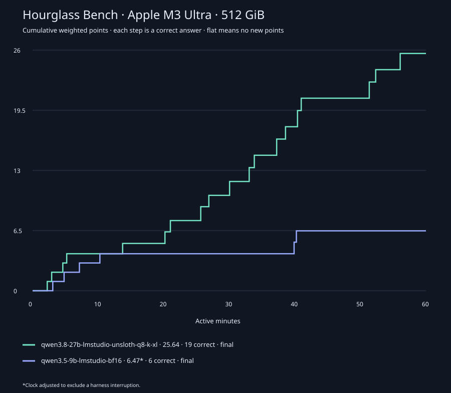
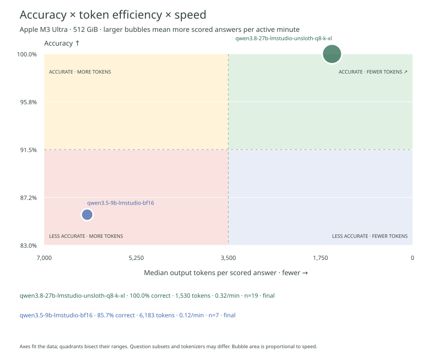

# Hourglass Bench result



[Individual score graph](score.svg) · [Comparison data](comparison.json)



Model: qwen3.8-27b-lmstudio-unsloth-q8-k-xl

**25.64 weighted points**, 19 correct. Status: **final**.

Fixed difficulty weights: charts 1–10 → 1–2; games 1–5 → 1–2; math high school / undergraduate / graduate → 1 / 1.5 / 2. One award per question within 3,600 active seconds.

Bank fingerprint: `a7fcbb2ee785a43c76bce115115aad356bc2d1862c594be724bdf0b7c70f409f`. Compare the same bank, order, repeat policy, model settings and hardware. Inference machine: Apple M3 Ultra · 512 GiB. Model configuration disclosure has not been supplied.

[Aggregate data](report.json)

Hardware source: local system query.

### Recorded inference hardware

```json
{
  "machine_key": "5245a46683e8452a77f42ddffc3efebac84502b5d693b384a9c07742681d59b4",
  "source": "local system query",
  "chip": "Apple M3 Ultra",
  "memory_bytes": 549755813888,
  "cpu_cores": 32,
  "gpu": [
    {
      "model": "Apple M3 Ultra",
      "cores": "80"
    }
  ],
  "label": "Apple M3 Ultra \u00b7 512 GiB",
  "captured_at": "2026-09-09T00:41:29.245647+00:00"
}
```
